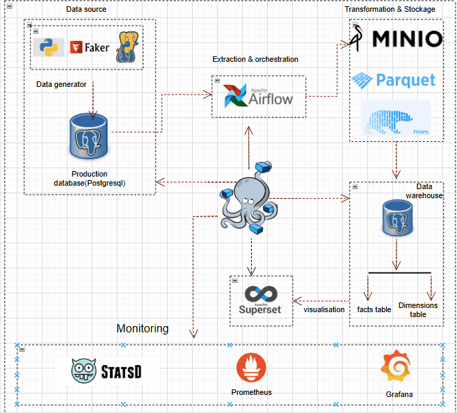

# ETL Pipeline Santé

<p align="center">
  
</p>

Ce projet implémente un pipeline ETL pour le traitement des données de santé, utilisant Airflow, Grafana, Prometheus et Superset.

## Architecture

- **Airflow** : Orchestration des tâches ETL
- **Grafana** : Visualisation des métriques de performance
- **Prometheus** : Collecte et stockage des métriques
- **Superset** : Analyse des données de santé
- **StatsD** : Agrégation des métriques

## Prérequis

- Docker et Docker Compose
- Python 3.8+
- PostgreSQL

## Installation

1. Cloner le repository
2. Installer les dépendances :
   ```bash
   pip install -r requirements.txt
   ```
3. Lancer les services :
   ```bash
   docker-compose up -d
   ```

## Configuration

### Base de données

1. Initialiser la base de données de production :
   ```bash
   psql -f init-prod-sante.sql
   ```
2. Initialiser la base de données analytique :
   ```bash
   psql -f init-analytics-sante.sql
   ```

### Airflow

- URL : http://localhost:8084
- Les DAGs sont dans le dossier `Dags/`
- Configuration dans `airflow.cfg`

### Grafana

- URL : http://localhost:3000
- Dashboards préconfigurés dans `Grafana/provisioning/Dashboards/`

### Superset

- URL : http://localhost:8088
- Dashboards dans `superset/dashboards/`

## Pipeline de Données

1. **Extraction** : Collecte des données depuis la base de production
2. **Transformation** : Nettoyage et agrégation des données
3. **Chargement** : Insertion dans la base analytique

## Métriques

- Taux d'occupation des établissements
- Coût moyen des consultations
- Performance du pipeline ETL

## Monitoring

- Métriques de performance dans Grafana
- Tableaux de bord d'analyse dans Superset
- Logs dans Airflow

## Maintenance

- Vérifier les logs Airflow régulièrement
- Monitorer les métriques de performance
- Maintenir les bases de données

